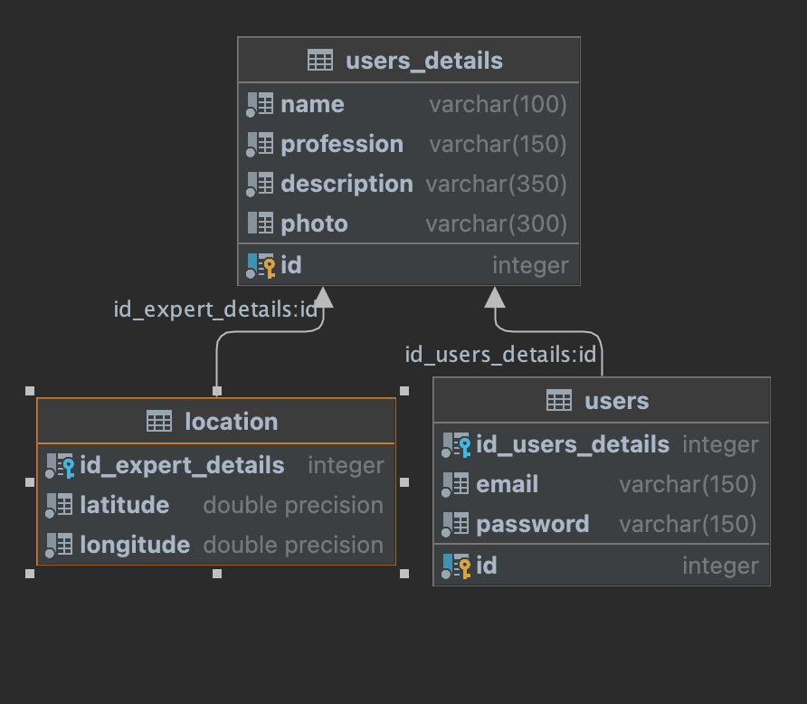
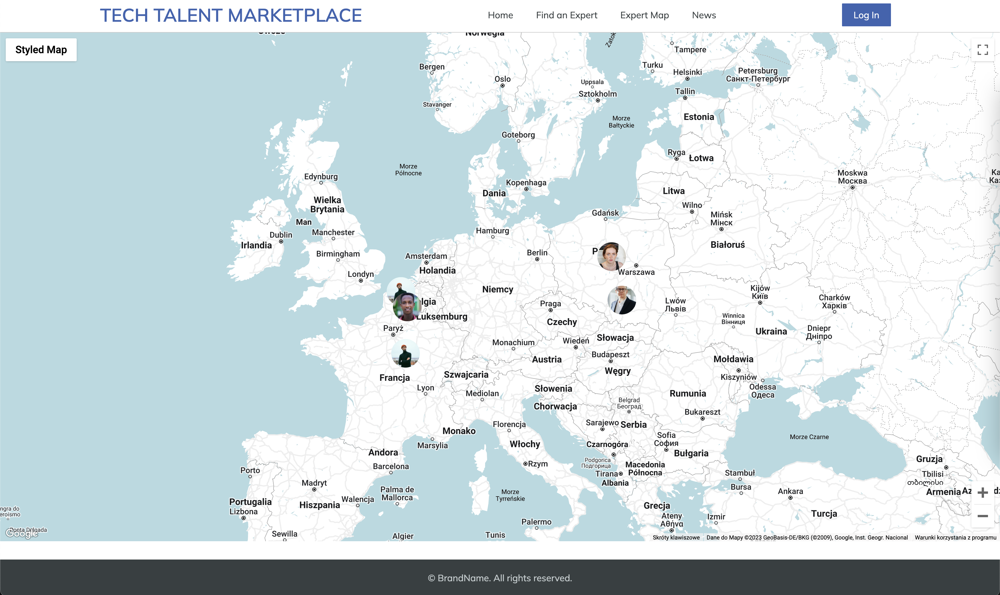
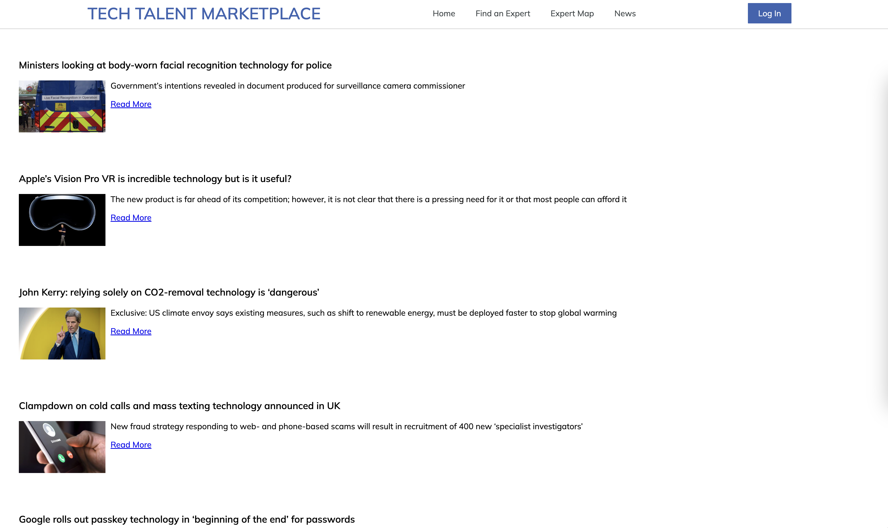
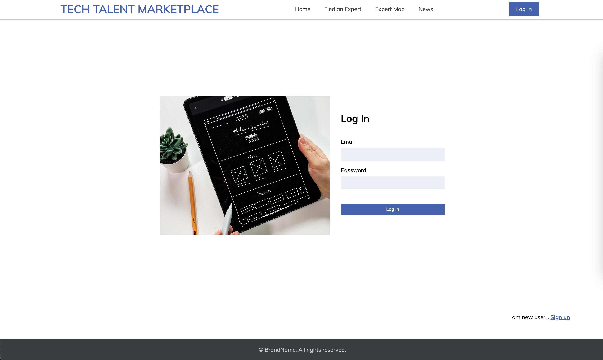
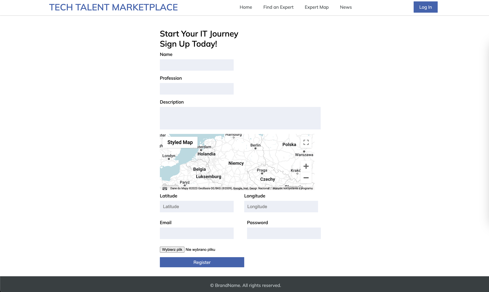
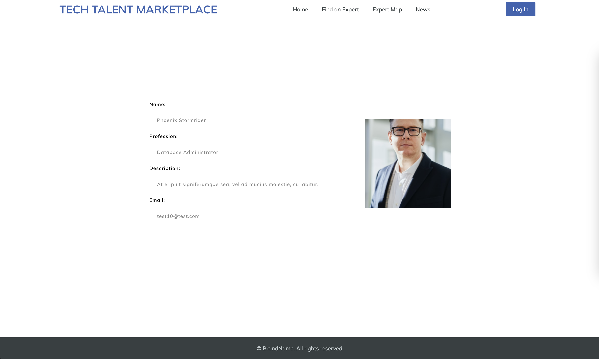
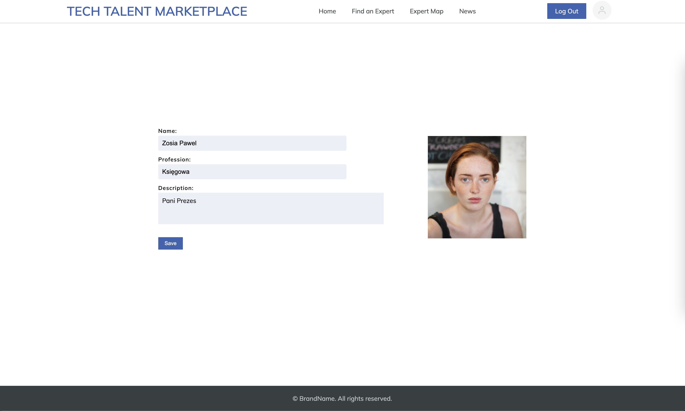

# Tech-Talent-Marketplace
The project "Tech-Talent-Marketplace" is a web application designed to facilitate the search for IT specialists. It provides users with the ability to create an account, find their desired specialists, and also allows experts to log in to the platform. The application was developed using PHP, JavaScript, HTML, and CSS.

Key features of the project include:

User Registration and Authentication: Users can create an account on the platform, providing their personal details and login credentials. They can then log in securely using their username and password.

Specialist Search: The application offers a search functionality that allows users to find IT specialists based on various criteria such as skills, experience, location, and availability. This feature helps users connect with the right experts for their specific needs.

Expert Profile: IT specialists can create their profiles on the platform, providing information about their skills, experience, qualifications, and contact details. This allows them to showcase their expertise to potential clients.

Maps Integration: The application incorporates maps to display the location of available IT specialists. Users can visualize the geographical distribution of experts and find those located nearest to them.

CRUD Operations: The project includes basic CRUD (Create, Read, Update, Delete) functionality to manage user accounts, specialist profiles, and other essential data. This allows administrators to maintain and modify the platform's content.

The Tech-Talent-Marketplace project aims to bridge the gap between IT specialists and those seeking their services by providing a user-friendly platform for connecting and collaborating.
 
## Table of Contents

- [Project Overview](#project-overview)
- [Features](#features) 
- [Technologies](#technologies)  
- [Database Information](#database-information)
- [Usage](#usage)
- [Status](#status)
- [Contact Page](#contact-page)

## Project Overview

Tech-Talent-Marketplace is a PHP-based web application that enables users to find and connect with IT specialists. It offers user registration, expert profiles, search functionality, maps integration, and basic CRUD operations

## Features

- Expert Search: Users can search for IT specialists based on their profession or username. This feature allows for quick and targeted searches to find the right experts.

- Expert Profiles: The application provides detailed profiles of IT specialists, allowing users to browse through their information, skills, qualifications, and contact details. This helps users assess the expertise and suitability of each expert.

- Map Integration: The application incorporates a map feature that enables users to search for experts based on their location. Users can visualize the distribution of experts worldwide and choose professionals located in specific areas.

- News Section: The application includes a dedicated "News" tab that integrates with the Guardian API to provide up-to-date technology news. Users can stay informed about the latest developments in the IT industry.

- Expert Registration: IT specialists who do not have an account can easily sign up and join the platform as experts. This allows them to showcase their skills and expertise to potential clients.

- Responsive Design: The application is designed to be responsive, ensuring a seamless browsing experience across various devices, including tablets and different-sized monitors.

These features enhance the usability and functionality of the Tech-Talent-Marketplace application, making it easier for users to find and connect with IT specialists in their desired locations and fields of expertise.

## Technologies

- PHP: The backend logic and server-side processing of the application are implemented using PHP. It handles tasks such as user authentication, data management, and communication with the database.

- HTML and CSS: HTML is used for structuring the web pages, while CSS is responsible for styling and layout. These technologies ensure the proper presentation of content and user interface elements.

- JavaScript: JavaScript is utilized for client-side interactivity and dynamic functionality within the application. It enables features such as real-time form validation, user interactions, and asynchronous data retrieval.

- PostgreSQL: The application employs PostgreSQL as the database management system to store and retrieve user information, expert profiles, and other relevant data. It provides a robust and scalable solution for data storage.

- Docker: The application is locally deployed and run using Docker. Docker allows for containerization, which encapsulates the application and its dependencies into isolated environments. This simplifies the setup and deployment process, ensuring consistent and reliable execution.

## Database Information

## Project Structure
   

### Home Page

### Find Experts Page

### Expert Map Page

 ### News Guardian Page

### Login Page

 ### Register Page

### Profile Page

 ### Edit Page

## Contact Page
Created by @lukieoo
* E-mail: pawkrzysciak@gmail.com
